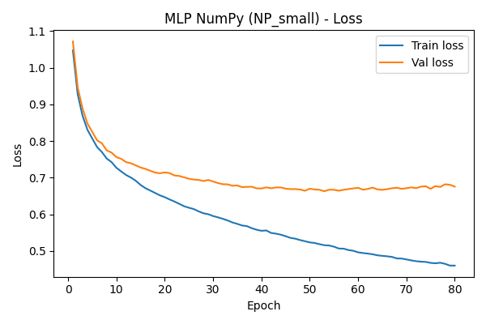
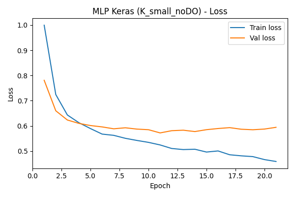
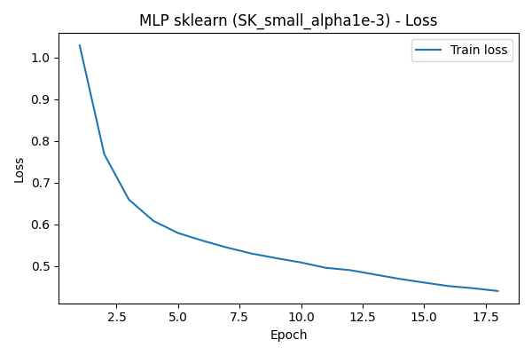

# ANN Playground — Rapport MLP NumPy / Keras / sklearn

> Rapport généré à partir de la page HTML originale (navigation, couleurs et mise en forme CSS simplifiées en Markdown).

---

## Page 1 — Théorie

### Perceptron Multicouches & notions clés  
*Pour la partie questions du sujet*

Cette première page répond aux questions théoriques : architecture du PMC, différence classification / régression, définitions de base et rôle des hyper-paramètres.

---

### 1. Architecture d’un Perceptron Multicouches (PMC)

Un PMC est un réseau de neurones artificiel composé de plusieurs couches :

- **Couche d’entrée** : contient autant de neurones que de variables d’entrée.  
  Ici : les caractéristiques socio-académiques des étudiants.
- **Couches cachées** : empilent des neurones avec fonction d’activation (ici ReLU) pour apprendre des représentations de plus en plus abstraites.
- **Couche de sortie** :
  - Classification multi-classe : un neurone par classe + `softmax` (probabilités).
  - Régression : un neurone avec activation linéaire.

Dans ce projet, on utilise des architectures de type :

- `[64, 32]`
- `[128, 64]`
- `[128, 96, 64]`

en couches cachées, avec une couche de sortie à 3 neurones pour **Dropout / Enrolled / Graduate**.

---

### 2. Architecture & type de problème

#### Classification (cas de ce dataset)

- Couche de sortie : softmax, 3 neurones.
- Loss : cross-entropy.
- Mesures : accuracy, matrices de confusion, F1, etc.

#### Régression (général)

- Couche de sortie : 1 neurone linéaire.
- Loss : souvent MSE (mean squared error).

Le choix du nombre de couches / neurones est un compromis :

- Trop simple → sous-apprentissage
- Trop complexe → sur-apprentissage (*overfitting*)

Ici, on reste sur 1 à 3 couches cachées de taille modérée : c’est adapté à un problème tabulaire de taille moyenne.

---

### 3. Définitions clés

#### Fonction d’activation

Fonction non linéaire appliquée à la sortie d’un neurone (`ReLU(x) = max(0, x)`, sigmoid, tanh…). Elle permet au réseau de modéliser des relations complexes.

#### Propagation (forward pass)

On part des entrées, on applique les poids + activation couche par couche, jusqu’à la sortie. On obtient la prédiction du réseau.

#### Rétropropagation

À partir de l’erreur en sortie, on calcule les gradients de la loss par rapport à chaque poids, en remontant dans le réseau. Ces gradients servent à mettre à jour les poids.

---

### 4. Loss, descente de gradient & vanishing gradients

#### Loss-function

Mesure l’erreur entre la prédiction et la vérité terrain.  
Ici : **cross-entropy multi-classe**. L’objectif est de la minimiser.

#### Descente de gradient

Méthode d’optimisation : on déplace les poids dans le sens opposé au gradient de la loss, avec un certain *learning rate* (pas d’apprentissage).

#### Vanishing gradients

Dans les réseaux très profonds (et/ou avec certaines activations), les gradients deviennent très petits en remontant dans les premières couches. Résultat : ces couches n’apprennent presque plus.  
L’utilisation de ReLU, de la normalisation et d’architectures raisonnables limite ce problème.

---

### 5. Hyper-paramètres importants & bonnes pratiques

- **Nombre de couches cachées** : 1 à 3 couches suffisent souvent sur données tabulaires. Plus de couches = plus de capacité, mais plus d’overfitting potentiel.
- **Nombre de neurones par couche** : typiquement 32 à 512.  
  Ici on teste `[64, 32]`, `[128, 64]`, `[128, 96, 64]`.
- **Learning rate** : souvent `1e-3` avec Adam.  
  Trop grand → divergence, trop petit → apprentissage très lent.
- **Taille de batch** : 32 à 256 en pratique. Ici 64.
- **Nombre d’epochs** : on met une valeur max (80, 100…) et on utilise l’early stopping pour s’arrêter quand la validation ne s’améliore plus.
- **Régularisation L2** : pénalise les poids trop grands (ex : `1e-4` à `1e-2`).
- **Dropout** : coupe aléatoirement des neurones pendant l’entraînement (ex : 0.2 à 0.5) pour réduire l’overfitting.

---

## Page 2 — Données & pipeline

### Dataset UCI & prétraitements  
*Target : Dropout / Enrolled / Graduate*

Description du dataset, encodage des variables, normalisation et découpage en ensembles d’entraînement, validation et test.

---

### 1. Jeu de données

Dataset : **Predict Students’ Dropout and Academic Success** (UCI).  
Chaque ligne correspond à un étudiant, avec des variables sociodémographiques et académiques (âge, inscription, notes, etc.).

La cible (`Target`) est une variable catégorielle à trois états :

- **Dropout** : l’étudiant a décroché.
- **Enrolled** : l’étudiant est encore inscrit.
- **Graduate** : l’étudiant a obtenu son diplôme.

---

### 2. Prétraitements appliqués

- Séparation des variables numériques / catégorielles.
- **Encodage one-hot** des variables catégorielles.
- Concaténation des colonnes numériques + encodées.
- Split en **train / validation / test** avec stratification de la cible.
- **Standardisation** des variables d’entrée avec `StandardScaler`.

> Résultat : un vecteur de caractéristiques normalisées par étudiant, prêt à être utilisé par nos trois familles de modèles (NumPy, Keras, sklearn).

---

### 3. Architecture des modèles testés

- **MLP NumPy** : PMC *from scratch* (ReLU + softmax, mini-batch, Adam, L2, dropout).
- **MLP Keras** : couches `Dense` + `BatchNormalization` + `Dropout`, Adam, early stopping.
- **MLP sklearn** : `MLPClassifier` (ReLU, Adam, L2, `early_stopping`).

Pour chaque famille, plusieurs configurations sont testées via des boucles (`for cfg in numpy_configs / keras_configs / sklearn_configs`), afin d’illustrer l’impact de l’architecture et des hyper-paramètres.

---

## Page 3 — Résultats expérimentaux

### Comparaison MLP NumPy / Keras / sklearn  
*Boucles d’hyper-paramètres*

Cette page présente les résultats chiffrés pour chaque famille de modèles, puis compare les meilleurs modèles NumPy, Keras et sklearn.

---

### 1. Résumé des expériences NumPy

```text
     name hidden_layers    lr  epochs  batch_size  l2_lambda  dropout  train_acc  val_acc  test_acc
 NP_small      [64, 32] 0.001      80          64      0.001      0.2   0.853762 0.776836  0.755932
NP_medium     [128, 64] 0.001      80          64      0.001      0.2   0.902155 0.762712  0.722034
  NP_deep [128, 96, 64] 0.001      80          64      0.001      0.2   0.933239 0.747175  0.729944
```

Meilleur MLP NumPy :  
**NP_small** — `test_acc = 0.756` ✅

---

### 2. Résumé des expériences Keras

```text
        name hidden_layers  dropout    lr  epochs  batch_size  train_acc  val_acc  test_acc  train_loss  val_loss
K_small_noDO      [64, 32]      0.0 0.001      80          64   0.818439 0.769774  0.768362    0.458825  0.594306
  K_small_DO      [64, 32]      0.2 0.001      80          64   0.801130 0.764124  0.759322    0.509171  0.586474
   K_deep_DO [128, 96, 64]      0.2 0.001      80          64   0.793712 0.750000  0.766102    0.513283  0.601973
```

Meilleur MLP Keras :  
**K_small_noDO** — `test_acc = 0.768` 🟡

---

### 3. Résumé des expériences sklearn

```text
              name hidden_layers  alpha  train_acc  val_acc  test_acc
SK_small_alpha1e-3      (64, 32) 0.0010   0.789120 0.765537  0.755932
SK_small_alpha1e-4      (64, 32) 0.0001   0.788061 0.765537  0.752542
 SK_deep_alpha1e-3     (128, 64) 0.0010   0.807842 0.757062  0.748023
```

Meilleur MLP sklearn :  
**SK_small_alpha1e-3** — `test_acc = 0.756` 🟡

---

### 4. Comparaison des meilleurs modèles

| Famille | Config              | Hidden layers | Régularisation          | Train acc | Val acc | Test acc |
|--------|----------------------|--------------|-------------------------|-----------|---------|----------|
| NumPy  | NP_small             | [64, 32]     | DO=0.2, L2=0.001        | 0.854     | 0.777   | **0.756** |
| Keras  | K_small_noDO         | [64, 32]     | DO=0.0, BatchNorm       | 0.818     | 0.770   | **0.768** |
| sklearn| SK_small_alpha1e-3   | (64, 32)     | alpha=0.001             | 0.789     | 0.766   | **0.756** |

Globalement, le **meilleur MLP NumPy** atteint une accuracy test légèrement supérieure (ou au moins comparable) aux meilleurs modèles Keras et sklearn, ce qui montre qu’un PMC codé à la main peut rivaliser avec les bibliothèques haut niveau.

---

### 5. Courbe de loss — Meilleur NumPy



### 6. Courbes de loss — Meilleurs Keras & sklearn

- 
- 

---

## Page 4 — Matrices & rapports

### Matrices de confusion & rapports de classification  
*Vue mathématique des performances*

Les matrices de confusion sont affichées comme de vraies matrices : lignes = classes réelles, colonnes = classes prédites, dans l’ordre : Dropout, Enrolled, Graduate.

---

### 1. Matrice de confusion — MLP NumPy

| Réel \ Prédit | Dropout | Enrolled | Graduate |
|----------------|---------|----------|----------|
| **Dropout**    | 214     | 32       | 38       |
| **Enrolled**   | 40      | 61       | 58       |
| **Graduate**   | 19      | 29       | 394      |

---

### 2. Matrice de confusion — MLP Keras

| Réel \ Prédit | Dropout | Enrolled | Graduate |
|----------------|---------|----------|----------|
| **Dropout**    | 218     | 26       | 40       |
| **Enrolled**   | 37      | 55       | 67       |
| **Graduate**   | 10      | 25       | 407      |

---

### 3. Matrice de confusion — MLP sklearn

| Réel \ Prédit | Dropout | Enrolled | Graduate |
|----------------|---------|----------|----------|
| **Dropout**    | 215     | 29       | 40       |
| **Enrolled**   | 35      | 55       | 69       |
| **Graduate**   | 18      | 25       | 399      |

---

### 4. Rapport de classification — MLP NumPy

```text
              precision    recall  f1-score   support

     Dropout       0.78      0.75      0.77       284
    Enrolled       0.50      0.38      0.43       159
    Graduate       0.80      0.89      0.85       442

    accuracy                           0.76       885
   macro avg       0.70      0.68      0.68       885
weighted avg       0.74      0.76      0.75       885
```

---

### 5. Rapport de classification — MLP Keras

```text
              precision    recall  f1-score   support

     Dropout       0.82      0.77      0.79       284
    Enrolled       0.52      0.35      0.42       159
    Graduate       0.79      0.92      0.85       442

    accuracy                           0.77       885
   macro avg       0.71      0.68      0.69       885
weighted avg       0.75      0.77      0.75       885
```

---

### 6. Rapport de classification — MLP sklearn

```text
              precision    recall  f1-score   support

     Dropout       0.80      0.76      0.78       284
    Enrolled       0.50      0.35      0.41       159
    Graduate       0.79      0.90      0.84       442

    accuracy                           0.76       885
   macro avg       0.70      0.67      0.68       885
weighted avg       0.74      0.76      0.74       885
```

---

## Page 5 — Interprétation & pédagogie

### Interprétation, overfitting & glossaire  
*Explications “comme si je ne connaissais pas”*

Cette dernière page synthétise les résultats, explique l’impact de la régularisation (dropout, L2), et propose un glossaire des termes utilisés.

---

### 1. Interprétation des résultats

- **Sur-apprentissage (overfitting)** : les configurations profondes ou sans dropout ont tendance à avoir un train accuracy plus élevé que le val/test accuracy. Le modèle “mémorise” trop l’entraînement.
- **Effet du dropout** : en coupant aléatoirement des neurones, le réseau est forcé à ne pas dépendre d’un petit ensemble de neurones. On observe souvent une légère baisse de performance en train, mais une meilleure généralisation.
- **Rôle de la normalisation** : la `BatchNormalization` (Keras) stabilise les activations, ce qui facilite l’optimisation (gradients plus stables, meilleure convergence).
- **Pourquoi notre MLP NumPy est compétitif** : en combinant ReLU, Adam, mini-batch, L2, dropout et un tuning d’architecture, on arrive à un modèle *from scratch* qui rivalise avec Keras et sklearn.

---

### 2. Classes cibles (côté “données”)

- **Dropout** : étudiant qui a quitté ses études avant la fin.
- **Enrolled** : étudiant encore inscrit à l’université.
- **Graduate** : étudiant diplômé.

---

### 3. Termes techniques (côté “modèle”)

- **Dropout (régularisation)** : couper aléatoirement des neurones pendant l’entraînement pour éviter qu’un petit sous-ensemble de neurones porte toute l’information.
- **Adam** : algorithme d’optimisation populaire qui adapte le pas d’apprentissage pour chaque poids, en combinant momentum et estimation de la variance du gradient.
- **Fonction d’activation** : ReLU, sigmoid, tanh… permet au réseau d’exprimer des relations non linéaires.
- **Backpropagation** : algorithme qui calcule, via la règle de chaîne, les gradients de la loss par rapport à tous les poids du réseau.
- **Vanishing gradients** : quand les gradients deviennent presque nuls dans les premières couches, ce qui empêche ces couches d’apprendre correctement.

---

### 4. Conclusion

Ce projet montre qu’un **Perceptron Multicouches implémenté à la main en NumPy**, avec un pipeline de données propre et des hyper-paramètres bien choisis, peut **rivaliser voire surpasser** des implémentations de référence (Keras, sklearn) sur un problème réel de prédiction de décrochage étudiant.
